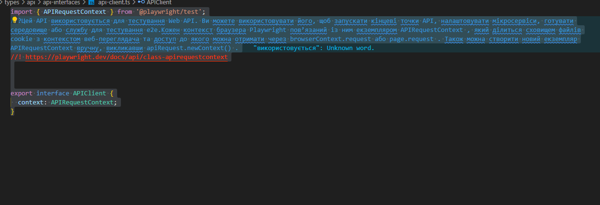

# Playwright API testing

This is a sample project to demonstrate [Playwright Test](https://playwright.dev/) usage, running tests against Contact List App [API](https://documenter.getpostman.com/view/4012288/TzK2bEa8/) and [Front-end](https://thinking-tester-contact-list.herokuapp.com/) (FE only started).

## Вступ

За допомогою плейврайта побудуємо фреймворк для тестування апі який буде виконувати наступні дії

- Валідація реквест схеми
- Валідація респонс схеми
- Валідація статус кодів
- Звітність із раном кодів

### Реалізація

1. Для початку давайте створимо АПІ інтрефейс АПІ клієнта, який буде реалізовувати нашо головну ідею приймати контекста та виконувати запити



2. Далі ми створимо інтерфес АПІ Контексту,

## Pre-requisites

### Node.js

Make sure you have the correct version of Node installed, which can be found in the `.nvmrc` file in the root of the repository. I also recommend running `npm i` to install all dependencies

## Packages and Descriptions

### [ajv](https://www.npmjs.com/package/ajv)

A JSON Schema validator for JavaScript, providing high-performance validation and error handling.

### [csv-parse](https://www.npmjs.com/package/csv-parse)

A CSV parsing library for JavaScript, allowing for asynchronous reading and parsing of CSV files.

### [dotenv](https://www.npmjs.com/package/dotenv)

A module that loads environment variables from a .env file into process.env, enhancing configuration management.

### [faker](https://www.npmjs.com/package/faker)

A library for generating fake data, useful for creating realistic test data for various scenarios.

### [joi](https://www.npmjs.com/package/joi)

A powerful schema description language and data validator for JavaScript, used to ensure data integrity and validity.

### [uuid](https://www.npmjs.com/package/uuid)

A library for generating unique identifiers (UUIDs), widely used for creating unique keys in databases and other systems.

## Structure

### Code is structured as shown below:

```

PLAYWRIGHT_TEST_FINAL_PROJECT
├── auth
│
├── .github
│   └── workflows                                        # GitHub Actions workflow files
│
├── .vscode
│   └── settings.json
│
├── app
│   ├── api
│   ├── components
│   ├── context
│   └── fixture
│       ├── combineFixture
│       └── logicFixture
│
├── pages
│
├── playwright-report
│
├── test-results
│
├── tests
│
├── utils
│   ├── constants
│   ├── data
│   ├── builder
│   ├── csv-files
│   ├── extensions
│   ├── helpers
│   ├── model
│   ├── schema
│   │   ├── requestAPI
│   │   ├── responseAPI
│   │   └── validators.ts
│   └── types
│       ├── api
│       │   ├── api-interfaces
│       │   └── endpoints
│       └── web
│           ├── browser
│           └── pages
|___________________________________________


```

**PS:** Note that different test levels are configured to have proper extensions (e.g: `*.api.test.js`).

## Running locally

- Install dependencies: `yarn install`
- Start Serverest server: `yarn api:start`
- Run API tests: `yarn test:api`
- Run End-to-end tests: `yarn test:e2e`

### Debugging
